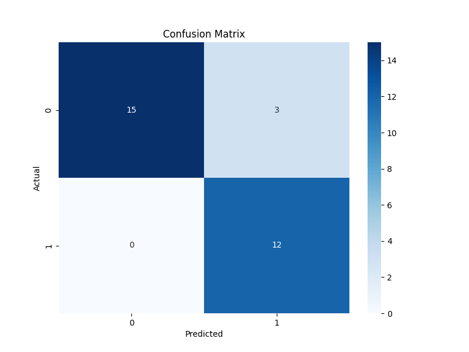

# Heart Disease Prediction

## Overview

This repository contains a machine learning project aimed at predicting the likelihood of heart disease in clients based on a comprehensive set of features,
including blood values and lifestyle questions such as smoking habits. Given the critical nature of accurately identifying potential heart disease cases,
special attention is devoted to minimizing false negatives, as failing to detect a condition could lead to severe consequences.

